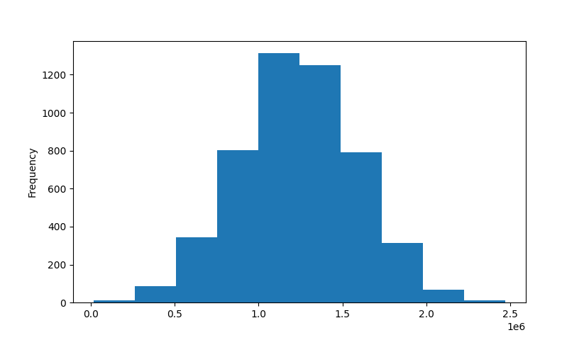

# cs6140_a2

## Collaborators

<b>Yihan Xu</b>
- NUID: 001566238

<b>Jake Van Meter</b>
- NUID: 002965845

## Links

- <a href="https://www.kaggle.com/datasets/vedavyasv/usa-housing">USA_Housing</a> - Kaggle csv used for this project.
- Consulted <a href="https://numpy.org/doc/stable/user/basics.broadcasting.html">Numpy's broadcasting documentation</a> and
this <a href="https://stackoverflow.com/questions/29241056/how-do-i-use-np-newaxis">stack overflow post on</a> `numpy.newaxis`
to figure out how to caluclate the distance between samples in two data sets efficiently.

## Operating System and IDE

<b>Yihan</b>
- <b>OS:</b> MacOS
- <b>IDE:</b> PyCharm

<b>Jake</b>
- <b>OS:</b> Windows 10
- <b>IDE:</b> VSCode

## Instructions for Running

Instructions for running from CLI: `python <path/to/assignment2>/main.py <desired_task>`
- Where you replace `<desired_task>` with one or more of the following options:
    - `all` to run all tasks.
    - `1` to run task one code.
    - `2` to run task two code.
    - `3` to run task three code.
    - `4` to run task four code.
- If no value is provided for `<desired_task>` all tasks are run.

Examples:
- Running all tasks: `python main.py all`
- Running just task 1: `python main.py 1`
- Running just task 2: `python main.py 2`
- Running just task 3: `python main.py 3`
- Running just task 4: `python main.py 4`
- Running a mixture of tasks 1 and 3: `python main.py 1 3`

The following dependencies were used and can be installed with `pip install <dependency>`:
1) NumPy
2) Pandas
3) Sklearn (installed with `pip install scikit-learn`)
4) Matplotlib
5) Seaborn

See `requirements.txt` for a list of all dependencies including those installed with the above packages.

## Overall structure of the project:
There are 6 files:
- nn.py: covers task 1, all the execution logic is in the `first_task()` function.
- cluster.py: covers tasks 2 and 3, all the execution logic is in the `main()` function.
- knn.py: covers task 4, all the execution logic is in the `fourth_task()` function.

All the datasets are under the datasets folder.

All the images are under the images folder.

## Instructions for Testing Extensions

The extensions we have covered:
- In task 1.C, created the confusion matrix to evaluate the KNN classifier.
- In task 2.C, tried 2 additional clustering algorithms other than k-means: hierarchical clustering and mean-shift clustering.
- In task 2.C, implemented 2 cluster quality metrics: Rissannon Minimum Description Length, Krzanowski and Lai.
- In task 1.B, implemented the nearest neighbor function such that it returns the error terms for each point.
- In task 2.E, applied k-means to projected data with weighted eigenvectors
- In task 4, did more exploration by trying different number of dimensions: 28 and 11 which explained 80% and 70% of variance respectively

## Reference

Distance metric:
- Normalized Euclidean Distance between data points $x, y$: $D = \sqrt{ \sum{ \frac{(x_i - y_i)^2}{\sigma_i} } }$
    - $i$ = column

Column 0: "Avg. Area Income"
- Min: 17796.6311895434
- Max: 107701.748377639
- Mean: 68583.10898395974
- Median: 68804.28640371619
- Variance: 113592776.71408534
- Standard Deviation: 10657.99121383037

Column 1: "Avg. Area House Age"
- Min: 2.64430418603671
- Max: 9.51908806613594
- Mean: 5.977222035280273
- Median: 5.970428947124805
- Variance: 0.9829853565194727
- Standard Deviation: 0.9914561798281721

Column 2: "Avg. Area Number of Rooms"
- Min: 3.2361940234262
- Max: 10.7595883359386
- Mean: 6.987791850907944
- Median: 7.002901987201935
- Variance: 1.0117004891419086
- Standard Deviation: 1.0058332312773866

Column 3: "Area Population"
- Min: 172.6106862729
- Max: 69621.7133777904
- Mean: 36163.51603857466
- Median: 36199.40668926055
- Variance: 98518530.1756471
- Standard Deviation: 9925.650113501235

Column 4: "Price"
- Min: 15938.6579232878
- Max: 2469065.5941747
- Mean: 1232072.654142357
- Median: 1232669.37796579
- Variance: 124692058202.24155
- Standard Deviation: 353117.6265810609

<b>Price Histogram:</b>

