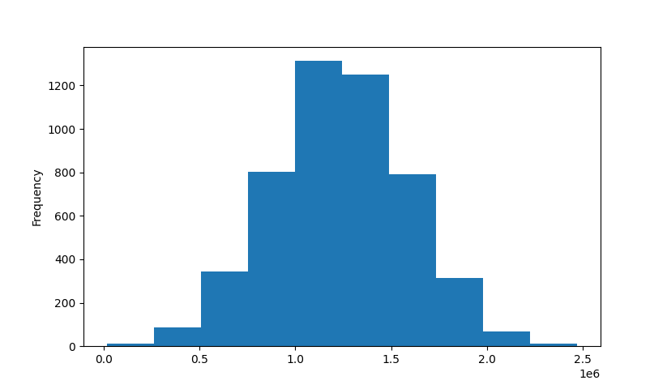

# cs6140_a2

## Reference

Distance metric:
- Normalized Euclidean Distance for column $i$: $D = \sqrt{ \sum{ \frac{(i_1 - i_2)^2}{\sigma_i} } }$

- Column 0: "Avg. Area Income"
    - Min: 17796.6311895434
    - Max: 107701.748377639
    - Mean: 68583.10898395974
    - Median: 68804.28640371619

- Column 1: "Avg. Area House Age"
    - Min: 2.64430418603671
    - Max: 9.51908806613594
    - Mean: 5.977222035280273
    - Median: 5.970428947124805

- Column 2: "Avg. Area Number of Rooms"
    - Min: 3.2361940234262
    - Max: 10.7595883359386
    - Mean: 6.987791850907944
    - Median: 7.002901987201935

- Column 3: "Area Population"
    - Min: 172.6106862729
    - Max: 69621.7133777904
    - Mean: 36163.51603857466
    - Median: 36199.40668926055

- Column 4: "Price"
    - Min: 15938.6579232878
    - Max: 2469065.5941747
    - Mean: 1232072.654142357
    - Median: 1232669.37796579

<b>Price Histogram:</b>

## Logistics

Dependency installation (if virtual environment is used):
- `pip install numpy scipy matplotlib scikit-learn pandas`

Jake:
- Create initial distance metric (Thursday night)
- Create confusion matrix (1.C)
- 2.D and 2.E
- 4
- Do more exploration in the final task, such as trying different numbers of dimensions after PCA.

Yihan:
- 1.C, 1.D
- 2.A-C
- 3
- Try out more clustering methods.
- Implement additional cluster quality metrics.

Files:
1) KNN
2) Clustering
3) PCA
4) Main

